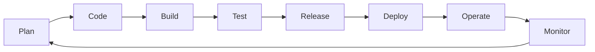
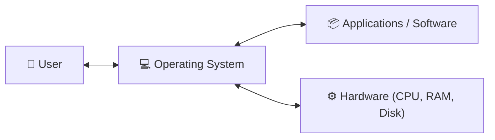
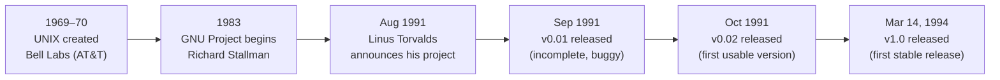
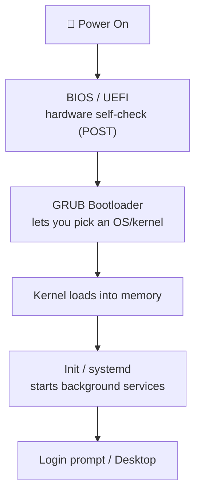
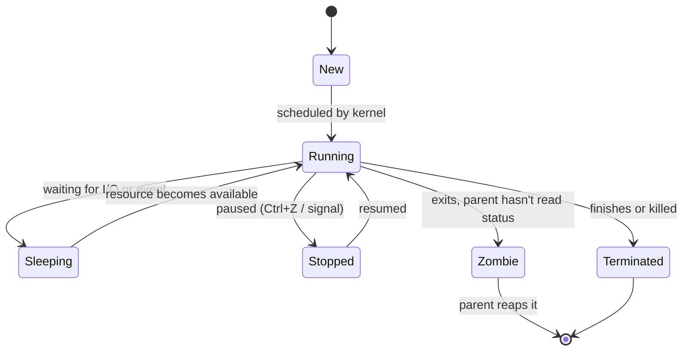
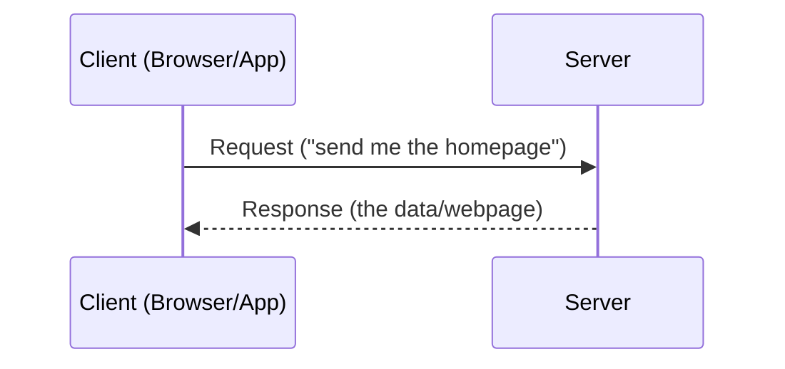

# Day 1 — DevOps Introduction & Linux Fundamentals
file:///C:/Users/pc6/Downloads/linux-architecture-diagram.svg
> Built from your handwritten Day 1 notes (DevOps intro + Linux intro), cleaned up, corrected, and expanded with diagrams and a few "try it yourself" commands.

## Table of Contents
- [Part 1: DevOps Introduction](#part-1-devops-introduction)
  - [1.1 What is an Application?](#11-what-is-an-application)
  - [1.2 Standalone Apps vs Web Apps](#12-standalone-apps-vs-web-apps)
  - [1.3 Application Support vs Application Maintenance](#13-application-support-vs-application-maintenance)
  - [1.4 What is DevOps?](#14-what-is-devops)
- [Part 2: Linux Fundamentals](#part-2-linux-fundamentals)
  - [2.1 What is an Operating System?](#21-what-is-an-operating-system)
  - [2.2 Types of Operating Systems](#22-types-of-operating-systems)
  - [2.3 What is Linux?](#23-what-is-linux)
  - [2.4 Why Use Linux?](#24-why-use-linux)
  - [2.5 History: UNIX → GNU → Linux](#25-history-unix--gnu--linux)
  - [2.6 UNIX vs Linux](#26-unix-vs-linux)
  - [2.7 Windows vs Linux](#27-windows-vs-linux)
  - [2.8 Linux Architecture](#28-linux-architecture)
  - [2.9 Process States in Linux](#29-process-states-in-linux)
- [Part 3: Internet & Servers](#part-3-internet--servers)
  - [3.1 What is the Internet?](#31-what-is-the-internet)
  - [3.2 What is a Server?](#32-what-is-a-server)
  - [3.3 Web Server vs Application Server](#33-web-server-vs-application-server)
- [Try It Yourself](#try-it-yourself)
- [Quick Recap / Cheat Sheet](#quick-recap--cheat-sheet)
- [Corrections & Additions Log](#corrections--additions-log)

---

## Part 1: DevOps Introduction

### 1.1 What is an Application?

An **application** is software built to solve one specific problem.

> **Example:** WhatsApp solves the problem of "how do I message someone instantly." A calculator app solves "how do I do quick math." Each app has one job.

### 1.2 Standalone Apps vs Web Apps

| | Standalone App | Web App |
|---|---|---|
| **Needs internet?** | No | Yes |
| **Where it runs** | Entirely on your device | Split between your device and remote servers |
| **Speed** | Fast (no network hop) | Depends on network + server load |
| **Scale** | Runs by itself | Often needs multiple servers to handle many users at once |
| **Examples** | Calculator, offline text editor | WhatsApp, Netflix |

**Analogy:** a standalone app is like a calculator sitting on your desk — everything it needs is inside it. A web app is like a phone call — it's useless without a working connection to something (someone) on the other end.

### 1.3 Application Support vs Application Maintenance

Your notes group these under "keeping the app healthy," which is the right instinct. The cleaner way to separate them (matching how real DevOps/IT teams use the terms) is **reactive vs proactive**:

| | Application Support | Application Maintenance |
|---|---|---|
| **Nature** | Reactive — respond to problems as they happen | Proactive — prevent problems before they happen |
| **Analogy** | A doctor doing a check-up / treating a symptom | A trainer keeping you generally fit so you don't get sick |
| **Typical tasks** | Check the app works across devices, fix live issues, monitor servers for errors | Update code, patch dependencies, clean up crashes, verify connections still work |
| **Timing** | During/after an incident | Ongoing, scheduled |

Both exist to do the same thing at different points in time: **keep the app clean, updated, and crash-free.**

### 1.4 What is DevOps?

**DevOps = Development + Operations**, working as one team instead of two separate ones.

- **Goal:** improve software delivery **speed**, **quality**, and **automation**.
- **Why it exists:** historically, Developers wanted to ship new features fast, while Operations wanted stability and were wary of change — this created friction and a "wall" between the two teams. DevOps removes that communication gap so both goals (fast *and* stable) can be achieved together.
- **How it does that in practice:** CI/CD pipelines, Infrastructure as Code (this is exactly where your Terraform course connects in), automated testing, monitoring/observability, and shared ownership of the product from code to production.


*The DevOps lifecycle is a loop, not a straight line — feedback from Monitor feeds back into Plan.*

---

## Part 2: Linux Fundamentals

### 2.1 What is an Operating System?

An **Operating System (OS)** is system software that acts as a **bridge between computer hardware and the user** (and between hardware and the other software running on it).



### 2.2 Types of Operating Systems

| Type | Examples | Typical Use |
|---|---|---|
| **Desktop OS** | Microsoft Windows, macOS, Ubuntu (Linux) | Everyday personal computing |
| **Server OS** | Enterprise Linux (RHEL, Ubuntu Server, CentOS/Rocky), Windows Server | Hosting websites, apps, databases |
| **Mobile OS** | Android, iOS | Smartphones/tablets |
| **Embedded OS** | Routers, Smart TVs, automobile control units, IoT devices | Runs on a specific device to do one job |
| **RTOS (Real-Time OS)** | Medical equipment, ECG monitors, ECU (Engine Control Unit), avionics | Guarantees a response within a strict, predictable time limit — a delayed response can be dangerous |

### 2.3 What is Linux?

Linux is a **free and open-source, Unix-like operating system**, historically known for being CLI-first (though most distributions now ship a full GUI too).

> **📝 Worth knowing:** strictly speaking, **"Linux" refers to the kernel** — the core engine. What people install (Ubuntu, Fedora, Debian, etc.) is a **distribution ("distro")**: the Linux kernel bundled with GNU tools, a package manager, and other software into a complete, usable OS. That's why you'll often see it written as **GNU/Linux**.

### 2.4 Why Use Linux?

- Free and open source — the source code is public, and anyone can inspect, modify, or redistribute it.
- Strong, powerful command line (CLI) for automation and control.
- Multitasking and stable — Linux servers routinely run for months/years without a reboot.
- Highly customizable.
- Large community support (forums, documentation, package repos).
- Runs on almost any hardware, from a Raspberry Pi to a supercomputer.

> **📝 Correction:** your notes say Linux has "no viruses" — that's a bit too strong. Linux isn't virus-*proof*, it's just a much smaller target for desktop malware, and its permission model (a normal user can't touch system files without explicit elevated `sudo` rights) makes damage much harder to do by accident or by a careless download. It's "more secure by design," not "immune."

**Why this matters for DevOps specifically:** Linux dominates the infrastructure you'll actually be deploying to. As of recent 2025–2026 industry data: roughly **45–53% of all server operating systems** are Linux (and growing), **90%+ of public cloud virtual machines** (AWS, Azure, GCP) run Linux, about **96% of the world's top 1 million web servers** run Linux, and **100% of the TOP500 supercomputers** run Linux. (Exact numbers vary by source/year, but the trend is the same: if you're doing DevOps/cloud work, you are working on Linux most of the time.)

### 2.5 History: UNIX → GNU → Linux



#### UNIX (1969–70)
- A **proprietary** operating system built at **Bell Labs (AT&T)**, primarily by **Ken Thompson and Dennis Ritchie**.
- UNIX is the "father" of Linux — Linux was designed to behave like UNIX, but UNIX is paid/proprietary while Linux is free.

#### GNU Project (1983)
- Started in **1983 by Richard Stallman** (your notes didn't have this name — worth remembering, he's frequently referenced in Linux history questions).
- **GNU** is a recursive acronym for **"GNU's Not Unix."**
- The GNU Project built all the free tools and packages needed to do CLI tasks (compilers, editors, shells) — everything needed for a full free OS **except a working kernel.**

#### Linux (1991)
- **Linus Torvalds**, a university student in Finland, built the missing piece: a free kernel.
- **September 1991:** version 0.01 released — not officially announced, incomplete.
- **October 1991:** version 0.02 released — the first genuinely usable version (could run `bash` and `gcc`).
- **March 14, 1994:** version **1.0** released — the first polished, production-ready **stable** release.

> **📝 Correction:** your notes had the "functional version" and the "March 14, 1994" date merged into one event. They're actually two different milestones: **v0.02 (Oct 1991)** was the first *functional* release, while **v1.0 (Mar 14, 1994)** was the first *stable/production* release — about 2.5 years apart.

Combine GNU's tools with Linux's kernel and you get a complete, free operating system — which is why the correct full name is **GNU/Linux**.

### 2.6 UNIX vs Linux

| Feature | UNIX | Linux |
|---|---|---|
| Source Type | Proprietary | Open Source |
| Cost | Paid/licensed | Free |
| Licensing | Vendor-controlled | Community + Enterprise support |
| Examples | Solaris, HP-UX | Red Hat, CentOS, Ubuntu |
| Hardware | Limited to specific hardware | Runs on almost any hardware |
| Development | Developed by companies/vendors | Community-driven development |

### 2.7 Windows vs Linux

| Feature | Windows | Linux |
|---|---|---|
| **Cost** | Paid license | Free and open source |
| **Best for** | Personal/everyday use | Servers and development |
| **Performance** | Moderate | Very efficient, especially on servers |
| **Security** | Needs antivirus/anti-malware | Highly secure by design (still not "hack-proof") |
| **Interface** | GUI-based | CLI + GUI |
| **Customization** | Limited | Highly customizable |
| **Typical use** | Games, movies, everyday desktop apps | Servers, coding, security-focused work |

### 2.8 Linux Architecture

Linux is organized in **layers**, where each layer only talks to the layer directly next to it — you (the user) interact from the outside in.


| Layer | What it is | Analogy |
|---|---|---|
| **Application** | The programs you actually use — browser, editor, games, your own code | The floors of a building where people live/work |
| **Shell** | Your **"chat window" with the OS** — a program that takes the commands you type and translates them into something the kernel understands | The building's front desk / receptionist |
| **Kernel** | The **core** of the OS. It's the bridge between hardware and software — it handles hardware allocation, memory management, process scheduling, and file system handling | The building's electrical, plumbing, and structural systems |
| **Hardware** | The physical machine — CPU, RAM, disk, network card | The literal land and foundation |

#### Shell
The shell is the interface — instead of writing raw code to talk to the kernel, you type a command and the shell handles the translation.

| Shell | Full name / notes |
|---|---|
| **Bash** | Bourne Again SHell — the default on most Linux distros |
| **Zsh** | Z Shell — feature-rich, default on modern macOS |
| **Fish** | Friendly Interactive Shell — very beginner-friendly, great autocompletion |
| **Ksh** | Korn Shell — built at Bell Labs, a superset of the original Bourne shell |
| **Csh** | C Shell — syntax modeled after the C programming language |

#### Kernel
The kernel is the **core component of the OS** — it acts as the bridge between hardware and software, handling:
- **Process management** — deciding what runs and when
- **Memory management** — allocating RAM to processes
- **Device management** — talking to hardware (disks, network cards, etc.)
- **File system handling** — reading/writing files

> **📝 Added detail:** the kernel runs in a protected **"kernel space"** with direct hardware access, while your applications run in **"user space"** and must go through the kernel to reach hardware. This separation is what keeps a crashing app from taking down the whole system.

#### Bootloader (GRUB)
**GRUB = GRand Unified Bootloader.** It's the program that wakes up the computer and starts the boot process — it allocates initial resources, then loads and hands control over to the kernel.



### 2.9 Process States in Linux

Your notes covered 4 states — here's the full picture with one addition (**Stopped**), since it's commonly tested alongside the other four.

| State | Meaning |
|---|---|
| **New** | Process is being created |
| **Running** | Actively using the CPU — working hard |
| **Sleeping / Waiting** | Paused, waiting for something (input, a resource, another process) |
| **Stopped** | Paused by a signal — e.g. you pressed `Ctrl+Z` — and won't resume until told to |
| **Zombie** | Finished executing, but its exit status hasn't been read by its parent process yet, so its entry lingers in the process table — a "ghost" process |
| **Terminated** | Done or killed, and fully cleaned up |



---

## Part 3: Internet & Servers

### 3.1 What is the Internet?

The internet is like a giant web made of fiber-optic cables spread across oceans, connecting to data centers all over the world.

### 3.2 What is a Server?

A **server** is just a computer that's always on duty, ready to help others. Types include email servers, file servers, and database servers.



**Client** asks for information → **Server** provides it. This is the **client-server model**, the foundation of basically everything on the internet.

### 3.3 Web Server vs Application Server

| | Web Server | Application Server |
|---|---|---|
| **Serves** | Static content (HTML pages, images, files) | Dynamic content (calculated/generated on the fly) |
| **Example use** | Serving a webpage's photos and layout | Instagram's feed, calculated per user |
| **Common tools** | Nginx, Apache | Python (Django), Node.js |

---

## Try It Yourself

A few commands that connect the concepts above to a real terminal:

```bash
# Check which shell you're using
echo $SHELL

# Check the Linux kernel version
uname -r

# Check OS / distribution details
cat /etc/os-release

# List running processes and their state
# (look at the STAT column: R = running, S = sleeping, Z = zombie, T = stopped)
ps aux
```

---

## Quick Recap / Cheat Sheet

- **DevOps** = Dev + Ops working together to ship software faster, better, with less friction.
- **Application Support** = reactive fixes. **Application Maintenance** = proactive upkeep.
- An **OS** bridges hardware and the user. Linux is a free, open-source, Unix-like OS.
- **UNIX (1969–70)** → **GNU (1983, Stallman)** → **Linux kernel (1991, Torvalds)** → combined = **GNU/Linux**.
- Linux architecture, outside → in: **Application → Shell → Kernel → Hardware.**
- **Shell** = your interface to type commands. **Kernel** = the core that talks to hardware. **GRUB** = the bootloader that starts everything up.
- Process states: **New → Running → Sleeping/Stopped → Terminated**, with **Zombie** as the leftover "ghost" state.
- **Client-server model**: client requests, server responds. **Web server** = static content, **App server** = dynamic content.

---

## Corrections & Additions Log

For transparency, here's what was fixed or added compared to the raw handwritten notes:

1. **Added** Richard Stallman as the founder of the GNU Project (1983) — not named in the original notes.
2. **Corrected** the Linux timeline: v0.02 (Oct 1991) was the first *functional* release; v1.0 (Mar 14, 1994) was the first *stable* release — these were merged into one date in the original notes.
3. **Corrected** UNIX's creation date/attribution: development began around 1969 at Bell Labs by Ken Thompson and Dennis Ritchie (notes only had "1970, AT&T").
4. **Corrected** the "Linux has no viruses" claim — reworded to "not virus-proof, just a much smaller/harder target."
5. **Added** the distinction between "Linux" (the kernel) vs. a "Linux distribution" (kernel + GNU tools + package manager).
6. **Added** the **Stopped** process state alongside Running / Sleeping / Zombie / Terminated for a complete picture.
7. **Added** kernel space vs. user space explanation.
8. **Expanded** GRUB's full name (GRand Unified Bootloader) and the full boot sequence.
9. **Added** current industry stats on Linux's dominance in servers/cloud (with the caveat that exact numbers vary by source/year).
10. **Fixed** various typos (comunicate → communicate, Windoes → Windows, dynmic → dynamic, propritary → proprietary, etc.)
11. **Reframed** Application Support vs. Maintenance using the standard reactive-vs-proactive distinction.
